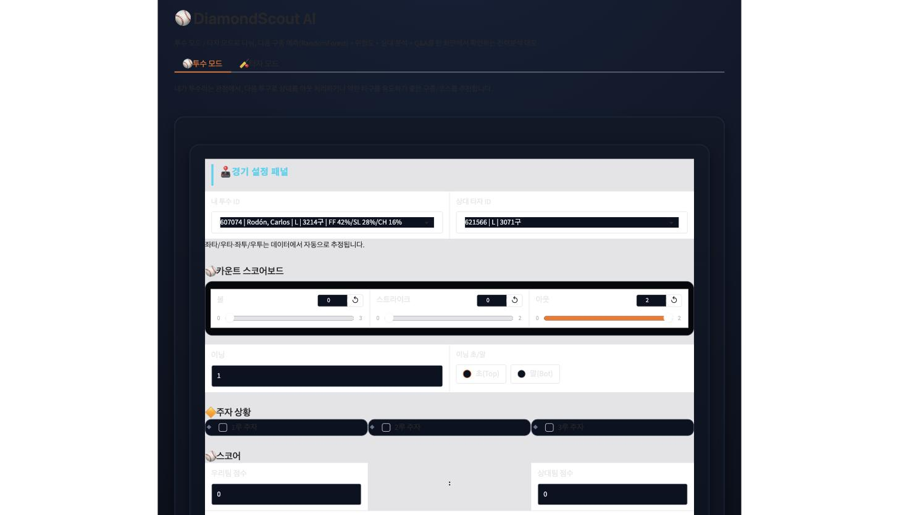
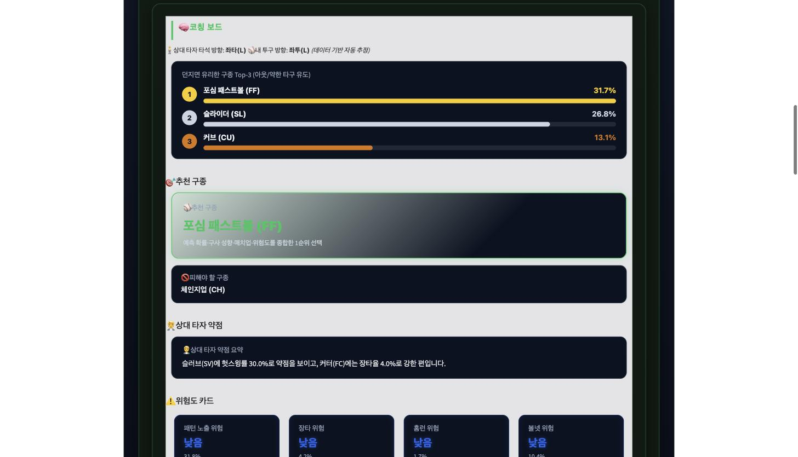
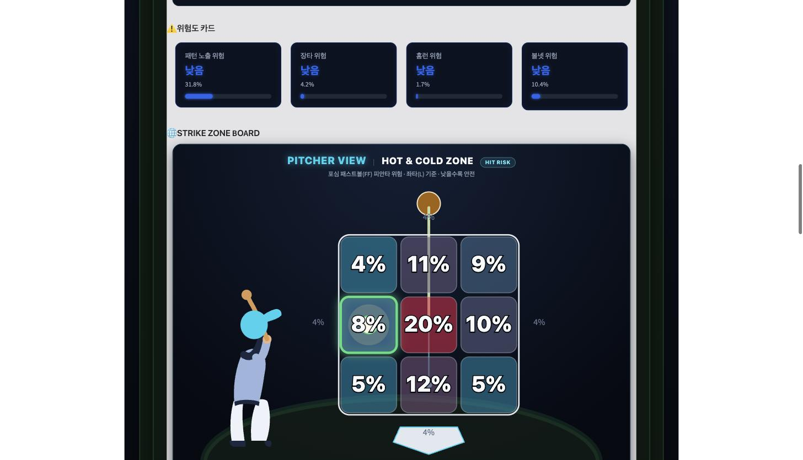
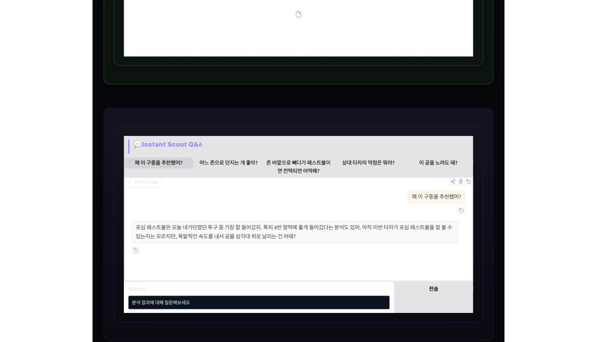
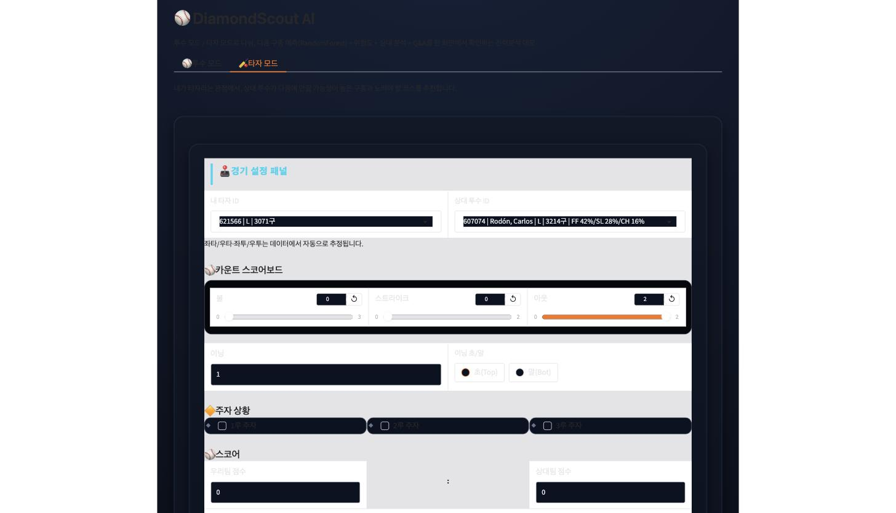
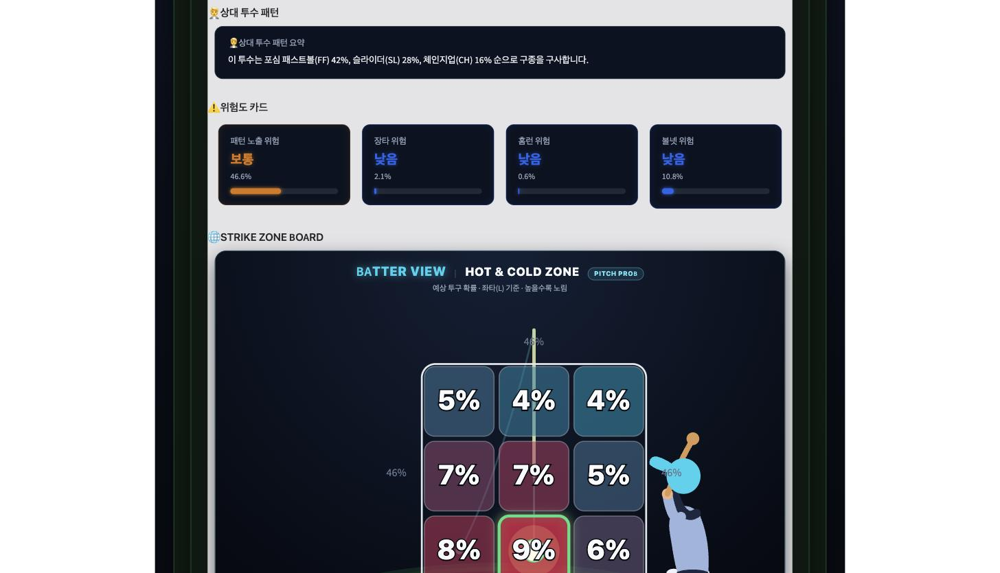
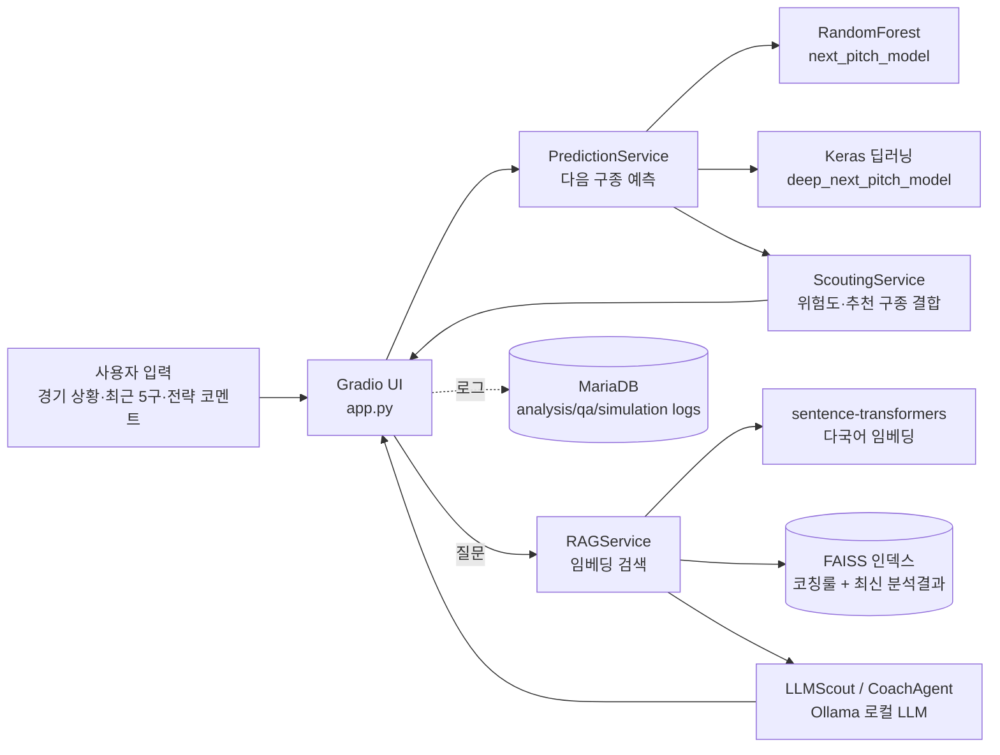

# DiamondScout AI

딥러닝으로 다음 구종을 예측하고, LLM이 투수·타자 각자의 관점에서 전력분석 코칭 리포트와 즉석 Q&A를 제공하는 야구 스카우팅 분석 도구입니다.

## 데모

- **바로 써보기**: https://579528e032e770b0ca.gradio.live
  - Gradio `share=True` 임시 터널 링크입니다 (최대 1주일, 로컬 실행 중일 때만 유효). 접속이 안 되면 아래 [로컬 실행](#로컬-실행)으로 직접 띄워서 확인해주세요.
- 투수 모드 / 타자 모드 모두 **4단계 위저드**(매치업 → 상황판 → 베이스&스코어 → 작전지시)로 진행되며, 상단 칩을 눌러 원하는 단계로 바로 이동할 수 있습니다.

## 핵심 기능

| 기능 | 설명 |
|---|---|
| **투수 모드** | 상대 타자의 최근 타석 패턴을 근거로 다음 구종 Top-3, 패턴 노출 위험도, 추천 코스를 3x3 스트라이크존 히트맵으로 제시 |
| **타자 모드** | 상대 투수의 다음 구종·궤적을 예측하고 노려야 할 코스/참아야 할 유인구를 타자 시점 화면으로 제시 |
| **타석 시뮬레이터** | 공을 한 구씩 입력하면 볼카운트가 갱신되며 매 투구마다 분석이 다시 실행됨 |
| **Instant Scout Q&A** | 방금 나온 분석 결과를 근거로 "왜 포심이 위험해?" 같은 후속 질문에 즉석 응답 |

## 스크린샷

| 투수 모드 입력 | 투수 모드 결과 (추천 구종·위험도) |
|---|---|
|  |  |

| 3x3 스트라이크존 히트맵 | Instant Scout Q&A |
|---|---|
|  |  |

| 타자 모드 입력 | 타자 시점 결과 |
|---|---|
|  |  |

## 기술 스택

| 영역 | 선택 | 왜 |
|---|---|---|
| 다음 구종 예측 | scikit-learn RandomForest + Keras 딥러닝 모델 병행 (`models/next_pitch_model.py`, `models/deep_next_pitch_model.py`) | 정형 피처(구속·궤적·카운트) 기반 예측이라 트리 모델로도 충분한 성능이 나오고, 해석 가능한 baseline으로 비교 대상이 필요했음 |
| 임베딩 | `sentence-transformers/paraphrase-multilingual-MiniLM-L12-v2` | 한국어 전략 코멘트와 한국어 코칭 룰 문서를 같은 벡터 공간에서 검색해야 해서 다국어 지원 모델 필요 |
| 벡터 검색 | FAISS `IndexFlatIP` (인메모리) | 도메인 문서·코칭 룰이 수십~수백 개 수준이라 근사 인덱스 없이 정확한 코사인 유사도 검색으로 충분 |
| LLM | Ollama 로컬 LLM | 전력분석 코멘트는 매치업 데이터를 그대로 프롬프트에 넣어야 해서, 외부 API로 보내지 않고 로컬에서 완결하는 편이 데이터 노출 부담이 없음 |
| UI | Gradio | 탭(투수/타자/시뮬레이터/Q&A) 구조와 실시간 상태 갱신을 적은 코드로 구현 가능 |
| 서비스 로그 DB | MariaDB | 분석 실행 기록/Q&A/시뮬레이션 투구 로그만 저장하는 용도라 가벼운 관계형 DB로 충분. `.env`에 접속 정보가 없으면 DB 로깅만 비활성화되고 핵심 기능은 그대로 동작하도록 분리 (`services/db_service.py`) |

## 아키텍처



- **개발 환경**: 로컬 macOS, `./venv` 가상환경, Ollama가 `localhost:11434`에서 상시 구동 중이어야 LLM 리포트/Q&A가 동작합니다. MariaDB 미설정 시 로그 저장만 꺼지고 핵심 기능은 정상 동작합니다.
- **배포 환경**: 별도 배포 없이 Gradio `share=True` 터널로만 공개되고 있어, 개발 환경과 동일한 로컬 프로세스에 의존합니다.

## 로컬 실행

```bash
git clone https://github.com/jjssspark/DiamondScout-AI.git
cd DiamondScout-AI
python -m venv venv
source venv/bin/activate  # Windows: venv\Scripts\activate
pip install -r requirements.txt

cp .env.example .env  # DB 로깅을 쓰려면 값 채우기 (선택)

python app.py
```

- Ollama가 로컬에 설치되어 있어야 LLM 코칭 리포트/Q&A가 동작합니다 (`brew install ollama` 후 사용할 모델을 pull).
- MariaDB 로그 저장을 쓰려면 `database/README.md`를 참고해 스키마를 먼저 생성하세요.
- 기본 포트는 `7862`이며, `app.py` 실행 시 로컬 URL과 함께 공개 URL(`share=True`)이 콘솔에 출력됩니다.

## 프로젝트 구조

```text
├── app.py           # 진입점 — 모델/서비스 조립 + Gradio UI
├── models/          # 다음 구종 예측 모델 (RandomForest, Keras)
├── services/        # 예측·전력분석·RAG·LLM 코칭·DB 로깅 등 비즈니스 로직
├── ui/              # 히트맵·궤적·Q&A 화면 컴포넌트
├── database/        # MariaDB 스키마 + 설정 가이드
├── data/            # Statcast 원본/전처리 데이터, 코칭 룰 문서 (data/knowledge/)
└── docs/            # PRD 등 상세 문서
```

## 더 읽을거리

- [PRD (제품 요구사항 정의서)](docs/PRD.md) — 서비스 컨셉, 전체 기능 명세, 리포트 형식 등 상세 스펙
