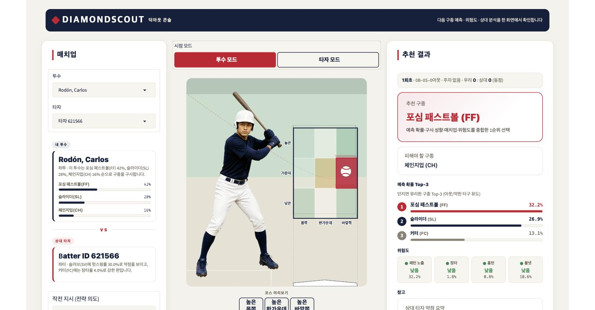
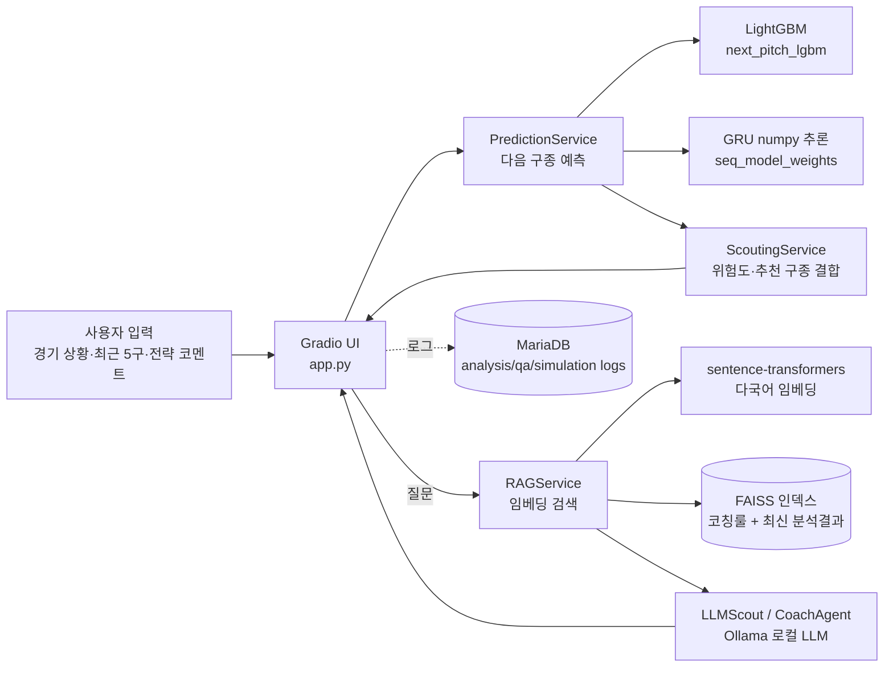

# DiamondScout AI

딥러닝으로 다음 구종을 예측하고, LLM이 투수·타자 각자의 관점에서 전력분석 코칭 리포트와 즉석 Q&A를 제공하는 야구 스카우팅 분석 도구입니다.

## 데모



- 바로 써보기: https://diamondscout-ai.onrender.com
  - Render 무료 티어라 접속이 없으면 인스턴스가 잠듭니다. 첫 로딩에 30초~1분 걸릴 수 있으니 잠시 기다려주세요. 접속이 안 되면 아래 [로컬 실행](#로컬-실행)으로 직접 띄워서 확인해주세요.
- 투수 모드 / 타자 모드를 한 화면 덕아웃 콘솔에서 세그먼트로 전환합니다. 좌측에 매치업, 가운데에 캔버스 스트라이크 존, 우측에 추천 결과를 두어 화면 이동 없이 상황을 바꿔가며 볼 수 있습니다.
- 스트라이크 존은 투수 시점 / 타자 시점 두 카메라로 그려지며, 상대 타석(좌타/우타)에 따라 인물·존·몸쪽/바깥쪽 라벨이 통째로 거울상으로 뒤집힙니다.

## 핵심 기능

| 기능 | 설명 |
|---|---|
| 투수 모드 | 상대 타자의 최근 타석 패턴을 근거로 다음 구종 Top-3, 패턴 노출 위험도, 추천 코스를 투수 시점 3D 스트라이크 존에 제시 |
| 타자 모드 | 상대 투수의 다음 구종·궤적을 예측하고 노려야 할 코스/참아야 할 유인구를 타자 시점 화면으로 제시 |
| 상황 조작 | 볼·스트라이크·아웃 램프, 주자, 이닝, 점수를 눌러 상황을 바꾼 뒤 `분석 실행`을 다시 누르면 그 상황 기준으로 재분석 |
| Instant Scout Q&A | 방금 나온 분석 결과를 근거로 "왜 포심이 위험해?" 같은 후속 질문에 즉석 응답 |
| 코칭 리포트 / PDF | 분석 근거를 문장으로 정리한 리포트를 화면에서 보고 PDF로 내려받기 |

## 스크린샷

화면 폭에 따라 3열 → 2열 → 1열로 접힙니다. 1열에서는 스트라이크 존이 맨 위로 올라옵니다.

| 1024px — 2열 | 768px — 2열 |
|---|---|
|  |  |

| 375px — 1열, 존이 상단 |
|---|
|  |

> 아래 구 UI 스크린샷(`01-`~`06-*.jpg`, `pitcher-mode-demo.gif`)은 4단계 위저드 시절 화면이라
> 현재 앱과 다릅니다. 기록용으로 파일만 남겨두었습니다.

## 기술 스택

| 영역 | 선택 | 왜 |
|---|---|---|
| 다음 구종 예측 | LightGBM + GRU 앙상블 (`models/lgbm_next_pitch.py`, `models/seq_infer.py`) | 정형 피처라 GBDT가 잘 맞고, 188MB RandomForest를 9.9MB로 줄이면서 정확도까지 올랐음. GRU는 직전 5구 궤적만 보는 쪽이라 LightGBM과 틀리는 지점이 달라 섞으면 오름. 학습만 Keras로 하고 서빙은 numpy 순전파라 배포에 TensorFlow가 안 들어감 (자세한 건 ADR-0006) |
| 임베딩 | `sentence-transformers/paraphrase-multilingual-MiniLM-L12-v2` | 한국어 전략 코멘트와 한국어 코칭 룰 문서를 같은 벡터 공간에서 검색해야 해서 다국어 지원 모델 필요 |
| 벡터 검색 | FAISS `IndexFlatIP` (인메모리) | 도메인 문서·코칭 룰이 수십~수백 개 수준이라 근사 인덱스 없이 정확한 코사인 유사도 검색으로 충분 |
| LLM | Ollama 로컬 LLM | 전력분석 코멘트는 매치업 데이터를 그대로 프롬프트에 넣어야 해서, 외부 API로 보내지 않고 로컬에서 완결하는 편이 데이터 노출 부담이 없음 |
| UI | Gradio | 탭(투수/타자/시뮬레이터/Q&A) 구조와 실시간 상태 갱신을 적은 코드로 구현 가능 |
| 서비스 로그 DB | MariaDB | 분석 실행 기록/Q&A/시뮬레이션 투구 로그만 저장하는 용도라 가벼운 관계형 DB로 충분. `.env`에 접속 정보가 없으면 DB 로깅만 비활성화되고 핵심 기능은 그대로 동작하도록 분리 (`services/db_service.py`) |

## 아키텍처



- 개발 환경: 로컬 macOS, `./venv` 가상환경, Ollama가 `localhost:11434`에서 상시 구동 중이어야 LLM 리포트/Q&A가 동작합니다. MariaDB 미설정 시 로그 저장만 꺼지고 핵심 기능은 정상 동작합니다.
- 배포 환경: Render 무료 티어(512MB)에 올라가 있습니다(`render.yaml`). 예측은 배포판에서 그대로 돌지만 LLM은 Groq hosted로, RAG 검색은 의존성을 빼서 꺼진 채로 degrade 합니다. 15분 무활동 시 슬립하고 다시 깨는 데 약 80초 걸립니다.

## 로컬 실행

```bash
git clone https://github.com/jjssspark/DiamondScout-AI.git
cd DiamondScout-AI
python -m venv venv
source venv/bin/activate  # Windows: venv\Scripts\activate
pip install -r requirements.txt

cp .env.example .env  # DB 로깅을 쓰려면 값 채우기 (선택)

python app.py
```

- Ollama가 로컬에 설치되어 있어야 LLM 코칭 리포트/Q&A가 동작합니다 (`brew install ollama` 후 사용할 모델을 pull).
- MariaDB 로그 저장을 쓰려면 `database/README.md`를 참고해 스키마를 먼저 생성하세요.
- 기본 포트는 `7862`이며, `app.py` 실행 시 로컬 URL과 함께 공개 URL(`share=True`)이 콘솔에 출력됩니다.

## 테스트

```bash
pip install pytest  # requirements.txt에 포함되어 있음
pytest tests/ -v
```

`PredictionService`의 피처 조립(`build_feature_row`)과 Top-k 예측 로직을 검증합니다. `models/*.joblib`은 용량 문제로 저장소에 포함하지 않으므로(`.gitignore`), 모델 로딩은 mock으로 격리되어 있어 클론 직후에도 바로 실행됩니다.

## 프로젝트 구조

```text
├── app.py           # 진입점 — 모델/서비스 조립 + Gradio UI
├── models/          # 다음 구종 예측 모델 (LightGBM + GRU) + 서빙 prior 테이블
├── services/        # 예측·전력분석·RAG·LLM 코칭·DB 로깅 등 비즈니스 로직
├── ui/              # 히트맵·궤적·Q&A 화면 컴포넌트
├── database/        # MariaDB 스키마 + 설정 가이드
├── data/            # Statcast 원본/전처리 데이터, 코칭 룰 문서 (data/knowledge/)
└── docs/            # PRD 등 상세 문서
```

## 더 읽을거리

- [PRD (제품 요구사항 정의서)](docs/PRD.md) — 서비스 컨셉, 전체 기능 명세, 리포트 형식 등 상세 스펙
- [ADR (아키텍처 결정 기록)](docs/ADR.md) — LightGBM + GRU 앙상블 전환, RAG+Ollama, Gradio 등 주요 기술 선택의 맥락과 근거
- [TROUBLESHOOTING](TROUBLESHOOTING.md) — 개발 중 겪은 버그·환경 이슈와 원인 추적 과정
- [회고](docs/RETROSPECTIVE.md) — 다시 만든다면 무엇을 다르게 할지, 남겨둔 기술 부채
- [성능·품질 지표](docs/PERFORMANCE.md) — 모델 정확도, 예측 응답 시간, 배포 메모리, Q&A 타임아웃 예산 실측치
