<div align="center">

# ⚾ DiamondScout AI

### 다음 공, 뭐 던질까

MLB 스탯캐스트 데이터로 다음 구종을 예측하고<br/>
LLM 코치가 그 이유까지 설명해주는 야구 전력분석 툴

<br/>

[](https://www.python.org/)
[](https://www.gradio.app/)
[](https://lightgbm.readthedocs.io/)
[](https://ollama.com/)
[](LICENSE)

[](https://diamondscout-ai.onrender.com)

<br/>

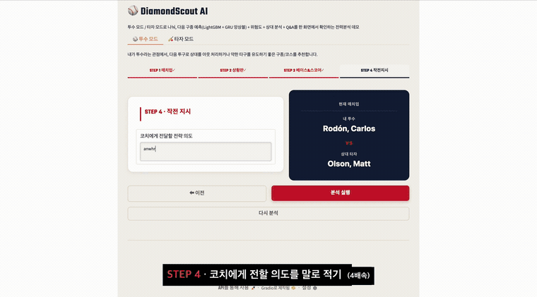

<sub>전체 데모 영상 → <a href="output/demo/diamondscout-demo.mp4">diamondscout-demo.mp4</a> (44초, 자막 있음)</sub>

</div>

<br/>

## 뭐 하는 건가

야구 중계 보면 해설위원이 "이 상황이면 슬라이더 각이죠" 하는 장면이 나옵니다. 그 판단을 데이터로 해보자는 게 이 프로젝트입니다.

지금 볼카운트, 주자, 점수, 직전 5구를 넣으면 다음에 올 구종을 확률로 뽑아줍니다. 여기까지는 그냥 분류 모델인데, 숫자만 던져주면 "그래서 뭘 하라는 건데"가 남습니다. 그래서 결과를 놓고 되물을 수 있는 LLM 코치를 붙였습니다. "왜 포심이야?"라고 물으면 방금 나온 예측 확률·구사 비율·상대 타자 약점을 근거로 묶어 답합니다.

<table>
<tr>
<td width="33%" align="center">

### 🎯 44.1%

다음 구종 top-1 정확도<br/>
<sub>최빈 구종 찍기 32.7% 대비 +11.4%p</sub>

</td>
<td width="33%" align="center">

### ⚡ 1.77ms

예측 1건 추론 시간<br/>
<sub>모델 크기 9.95MB</sub>

</td>
<td width="33%" align="center">

### 📊 86.6%

top-3 정확도<br/>
<sub>구종 11개 클래스 분류</sub>

</td>
</tr>
</table>

> [!NOTE]
> 배포는 Render 무료 티어라 15분 동안 접속이 없으면 인스턴스가 잠듭니다. 첫 로딩에 30초에서 1분쯤 걸리니 잠깐 기다려주세요. 그래도 안 열리면 [로컬 실행](#-실행)으로 직접 띄우면 됩니다.

<br/>

## ✨ 핵심 기능

| | 기능 | 하는 일 |
|:---:|---|---|
| 🥎 | 투수 모드 | 상대 타자의 최근 타석 패턴을 근거로 다음 구종 Top-3, 패턴 노출 위험도, 추천 코스를 투수 시점 3D 스트라이크 존에 제시 |
| 🏏 | 타자 모드 | 상대 투수의 다음 구종과 궤적을 예측하고, 노려야 할 코스와 참아야 할 유인구를 타자 시점 화면으로 제시 |
| 🎛️ | 상황 조작 | 볼·스트라이크·아웃 램프, 주자, 이닝, 점수를 눌러 상황을 바꾼 뒤 다시 분석하면 그 상황 기준으로 재계산 |
| 💬 | Instant Scout Q&A | 방금 나온 분석 결과를 근거로 "왜 포심이 위험해?" 같은 후속 질문에 바로 답변 |
| 📄 | 코칭 리포트 | 분석 근거를 정해진 형식으로 정리해 화면에 띄우고 PDF로 내려받기. 템플릿 조립이라 LLM 없이도 그대로 나옴 |

<br/>

## 🖥️ 화면

### 네 단계로 상황을 입력한다

<table>
<tr>
<td width="50%">

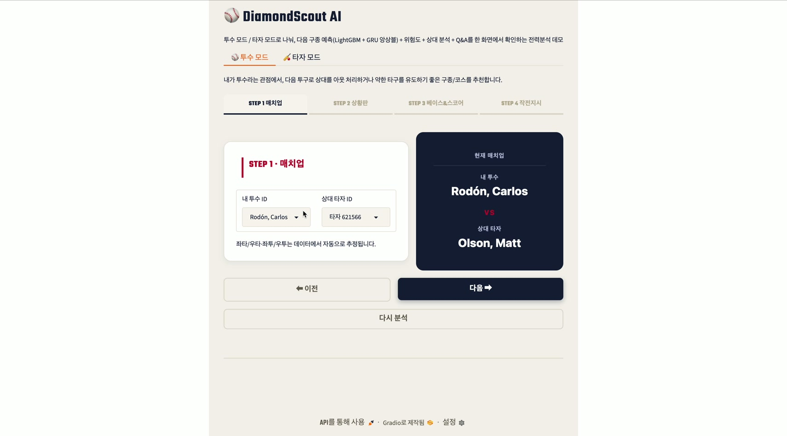

STEP 1 · 내 투수와 상대 타자를 고릅니다. 좌타·우타와 좌투·우투는 데이터에서 알아서 채워집니다.

</td>
<td width="50%">

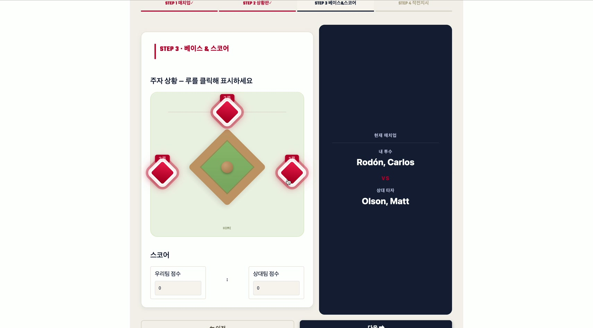

STEP 3 · 다이아몬드에서 베이스를 눌러 주자를 놓고, 이닝과 점수를 맞춥니다.

</td>
</tr>
</table>

### 결과는 근거까지 같이 나온다

<table>
<tr>
<td width="50%">

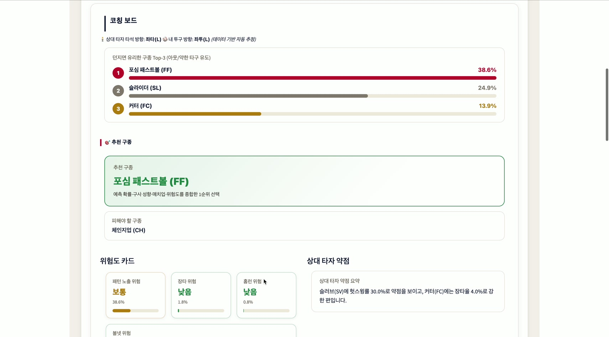

예측 Top 3 구종, 추천 구종과 피해야 할 구종, 위험도 카드 네 개, 상대 타자 약점 요약이 한 화면에 나옵니다.

</td>
<td width="50%">

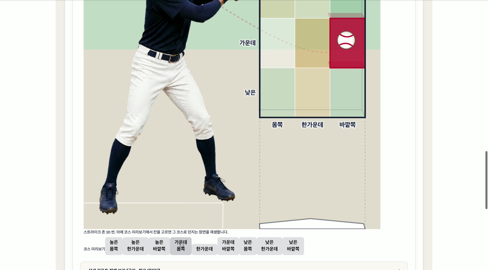

추천 코스를 3D 스트라이크 존에 찍어줍니다. 아래 코스 버튼을 누르면 그 자리로 던지는 장면이 재생됩니다.

</td>
</tr>
</table>

### 결과를 놓고 되물을 수 있다

<div align="center">
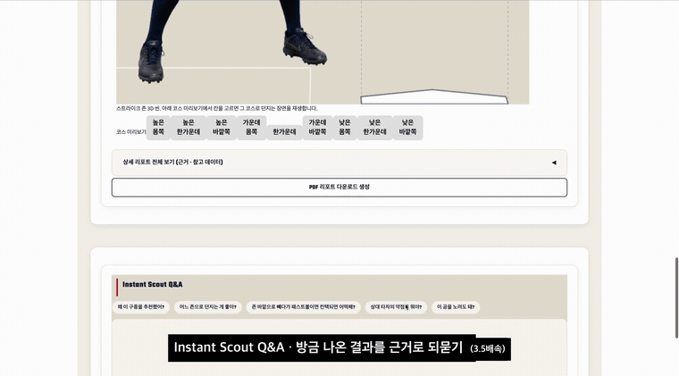
</div>

방금 나온 분석 결과가 그대로 근거로 들어가서, "왜 이 구종을 추천했어?"라고 물으면 예측 확률·구사 비율·상대 타자 약점·위험도를 묶어서 답합니다. 매번 새로 만드는 답이라 상황이 바뀌면 답도 바뀝니다.

### 화면 폭에 따라 접힌다

3열 → 2열 → 1열로 바뀌고, 1열에서는 스트라이크 존이 맨 위로 올라옵니다.

<table>
<tr>
<td width="40%">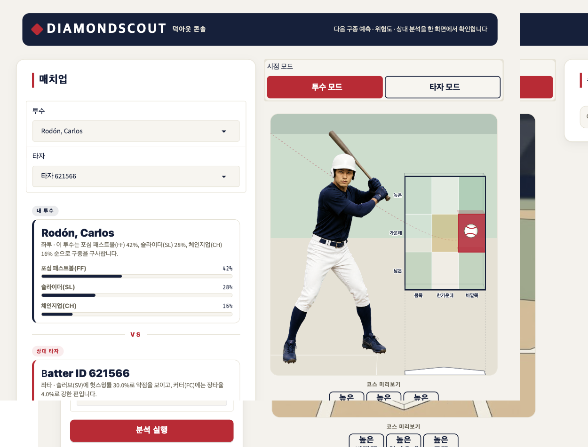<div align="center"><sub>1024px</sub></div></td>
<td width="40%">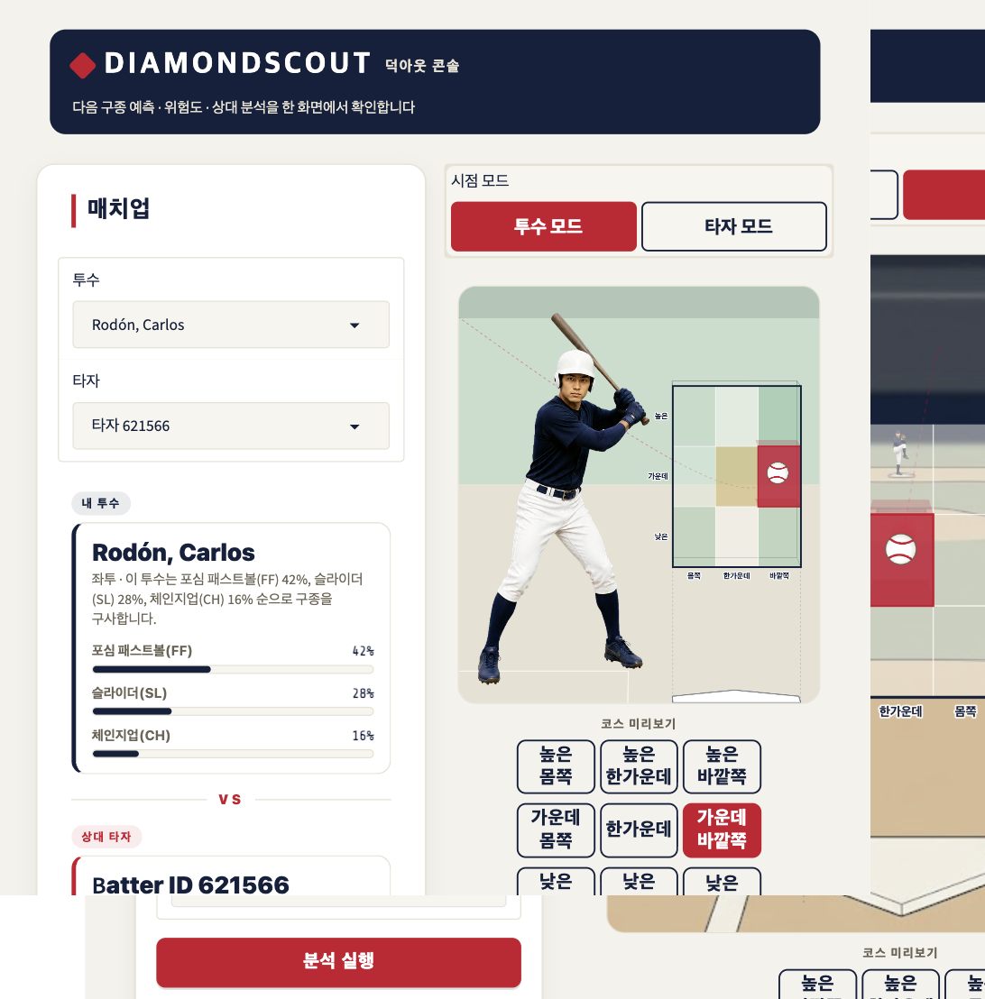<div align="center"><sub>768px</sub></div></td>
<td width="20%">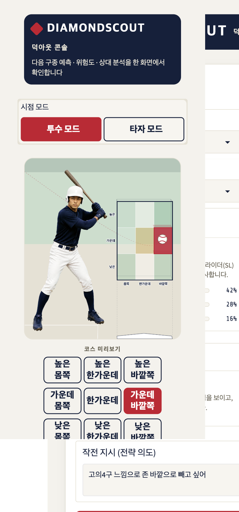<div align="center"><sub>375px</sub></div></td>
</tr>
</table>

<br/>

## 🏗️ 어떻게 동작하나

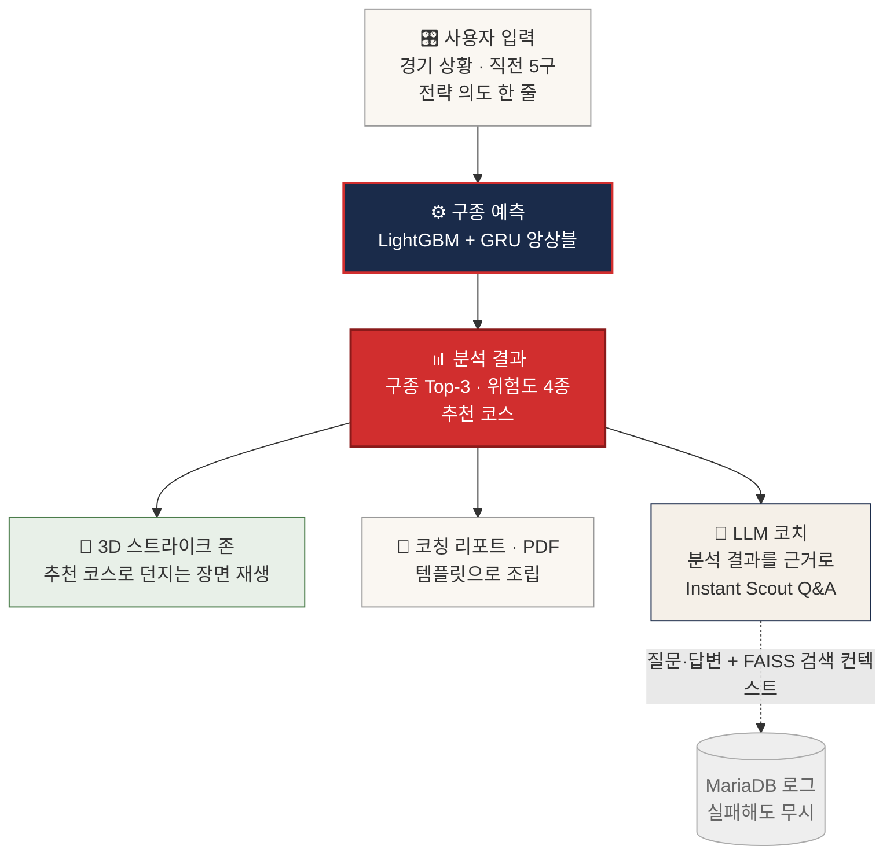

예측기 두 개를 섞어 씁니다. 성격이 다른 모델이라 틀리는 지점도 다릅니다.

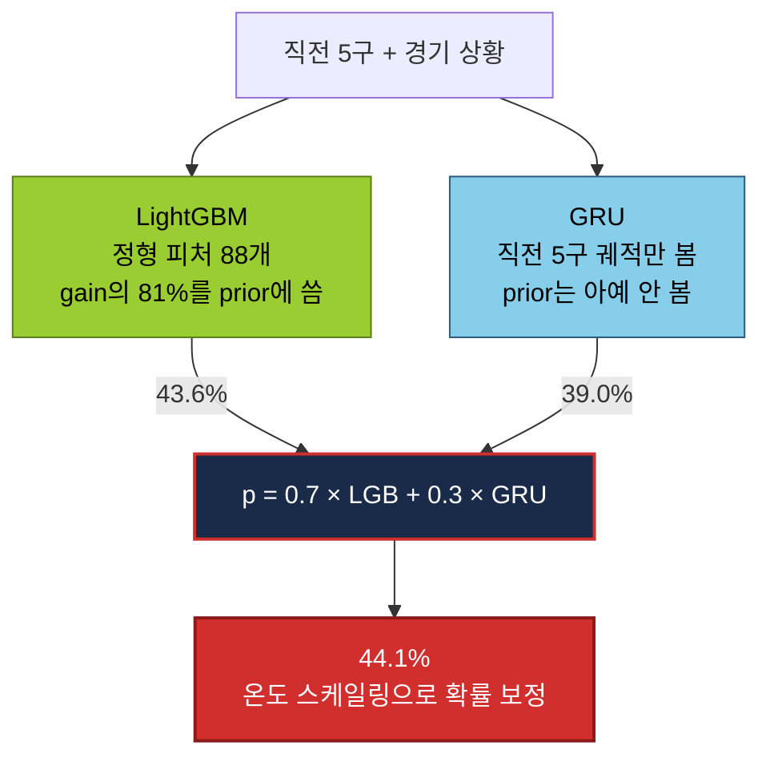

GRU 단독은 LightGBM보다 4.6%p 낮은데도 섞으면 오릅니다. LightGBM은 투수·타자 prior에 크게 기대고, GRU는 prior를 안 보고 직전 5구 궤적만 봐서 그렇습니다.

<br/>

## 📈 모델 성능

2025시즌 스탯캐스트, held-out 88,983건 같은 split으로 전부 다시 쟀습니다.

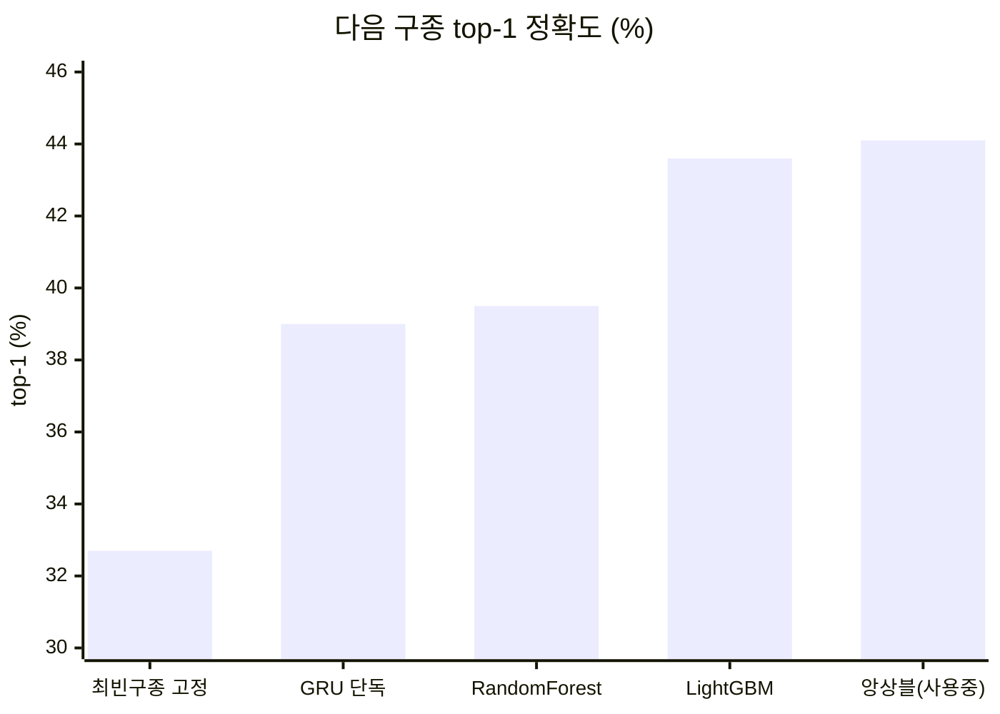

| 모델 | 피처 | top-1 | top-3 | 크기 | 추론 |
|---|---:|---:|---:|---:|---:|
| 최빈 구종 고정 (FF) — 베이스라인 | — | 32.7% | 61.1% | — | — |
| GRU (numpy) 단독 | 45 | 39.0% | 79.4% | 61KB | — |
| RandomForest — 2026-08-17까지 쓰던 것 | 56 | 39.5% | 78.7% | 188MB | 23.6ms |
| LightGBM | 88 | 43.6% | 85.7% | 9.89MB | 1.67ms |
| ⭐ LightGBM + GRU 앙상블 — 지금 쓰는 것 | 88 + 45 | 44.1% | 86.6% | 9.95MB | 1.77ms |

RandomForest에서 앙상블로 갈아타면서 모델이 188MB에서 9.95MB로 줄고 추론은 13배 빨라졌는데 정확도까지 올랐습니다. 덕분에 512MB짜리 무료 인스턴스에 올릴 수 있게 됐습니다.

### 확률을 정직하게 만드는 작업도 했다

화면에 "포심 38.6%"를 그대로 띄우니까 그 숫자가 실제 빈도와 맞아야 합니다. 온도 스케일링으로 보정했고, ECE가 0.0126에서 0.0081로 내려갔습니다.

<div align="center">
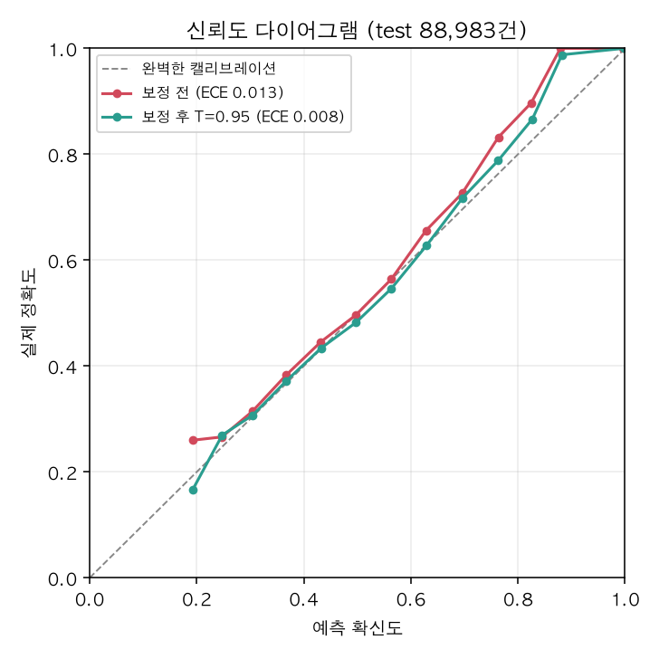
</div>

곡선이 대각선 위에 있었다는 건 모델이 소극적이었다는 뜻입니다. 47%라고 말해놓고 실제로는 그보다 자주 맞히고 있었습니다.

측정 과정과 실패한 시도까지 전부 [docs/PERFORMANCE.md](docs/PERFORMANCE.md)에 있습니다.

<br/>

## 🧰 기술 선택과 이유

| 영역 | 고른 것 | 왜 |
|---|---|---|
| 구종 예측 | LightGBM + GRU 앙상블 | 정형 피처라 GBDT가 잘 맞음. 188MB RandomForest를 9.9MB로 줄이면서 정확도까지 올랐음. GRU는 직전 5구만 봐서 LightGBM과 틀리는 지점이 달라 섞으면 오름. 학습만 Keras로 하고 서빙은 numpy 순전파라 배포에 TensorFlow가 안 들어감 |
| 벡터 검색 | FAISS IndexFlatIP + paraphrase-multilingual-MiniLM-L12-v2 | 코칭룰과 방금 나온 분석 결과를 인덱스에 넣고 질문과 비슷한 조각을 찾음. 한국어 문서라 다국어 임베딩이 필요했고, 문서가 수백 개 수준이라 근사 인덱스 없이 정확한 코사인 유사도로 충분. 다만 지금 이 검색 결과는 답변 생성에 들어가지 않고 Q&A 로그에만 남는다 (아래 참고) |
| LLM | Ollama (로컬) / Groq (배포) | Q&A 답변을 만드는 유일한 LLM 경로. 매치업 데이터를 그대로 프롬프트에 넣어야 해서 로컬에서 끝내는 쪽이 부담 없음. 다만 무료 인스턴스에 Ollama를 상시 띄울 수 없어서 배포판만 Groq으로 바꿈 |
| UI | Gradio | 탭 구조와 실시간 상태 갱신을 적은 코드로 만들 수 있음 |
| 로그 DB | MariaDB | 분석·Q&A·시뮬레이션 기록만 저장하는 용도라 가벼운 관계형 DB면 충분. `.env`에 접속 정보가 없으면 로깅만 꺼지고 나머지는 그대로 돌아감 |

### FAISS를 붙여놓고 답변에는 안 쓰는 이유

솔직하게 적어둡니다. FAISS 인덱스는 만들어져 있고 질문이 들어올 때마다 검색도 돕니다. 그런데 검색 결과(`context_chunks`)는 `db_save_qa_log()`로만 흘러가고, 답변을 만드는 `CoachAgent.answer()` 인자에는 들어가지 않습니다.

그래서 지금 Q&A 답변은 RAG 결과가 아니라 방금 나온 분석 결과 자체를 근거로 만듭니다. 예측 확률, 구사 비율, 상대 타자 약점, 위험도를 프롬프트에 직접 넣습니다. 검색 결과는 "그때 어떤 코칭룰이 가까웠는지"를 로그에 남기는 용도로만 씁니다.

배포판 의존성에서 `faiss-cpu`와 `sentence-transformers`를 뺀 것도 이 때문입니다. 빠지면 `rag_service=None`으로 degrade 하는데 답변은 그대로 나옵니다. 512MB 인스턴스에서 답변에 안 쓰이는 임베딩 모델을 올릴 이유가 없었습니다.

고민했던 것과 버린 것은 [docs/ADR.md](docs/ADR.md)에 결정 단위로 정리해뒀습니다. 다만 ADR-0002는 "FAISS RAG + Ollama 채택"으로 적혀 있어 지금 구현과 어긋납니다. 아직 갱신하지 않았습니다.

<br/>

## 🚀 실행

```bash
git clone https://github.com/jjssspark/DiamondScout-AI.git
cd DiamondScout-AI

python -m venv venv
source venv/bin/activate          # Windows는 venv\Scripts\activate
pip install -r requirements.txt

cp .env.example .env              # DB 로깅 쓸 거면 값 채우기 (선택)
python app.py
```

기본 포트는 `7862`입니다. 실행하면 로컬 주소와 공개 주소가 콘솔에 같이 찍힙니다.

<details>
<summary>선택으로 붙이는 것들</summary>

<br/>

- Instant Scout Q&A를 LLM으로 돌리려면 Ollama가 로컬에 떠 있어야 합니다. `brew install ollama` 후 쓸 모델을 pull 하세요. Ollama가 없어도 앱은 돌아가고, 근거 기반 문장 조합으로 대체 답변이 나갑니다.
- MariaDB 로그 저장을 쓰려면 [`database/README.md`](database/README.md)를 보고 스키마부터 만드세요. 안 만들어도 로깅만 꺼집니다.
- 배포는 `render.yaml` 하나로 됩니다. 무료 인스턴스에서는 FAISS 검색이 의존성에서 빠져 `rag_service=None`으로 degrade 하는데, 답변 생성에는 안 쓰이므로 Q&A는 그대로 동작합니다.

</details>

### 테스트

```bash
pytest tests/ -v
```

`PredictionService`의 피처 조립과 Top-k 예측 로직을 검증합니다. 모델 파일은 용량 때문에 저장소에 없어서 로딩은 mock으로 격리해뒀습니다. 클론 직후 바로 돌아갑니다.

<br/>

## 📁 프로젝트 구조

```text
DiamondScout_AI/
├── app.py              진입점 — 모델·서비스 조립 + Gradio UI
├── models/             구종 예측 모델 (LightGBM + GRU) + 서빙 prior 테이블
├── services/           예측·전력분석·LLM 코치·벡터검색·DB 로깅
├── ui/                 히트맵·궤적·Q&A 화면 컴포넌트
├── database/           MariaDB 스키마와 설정 가이드
├── data/               스탯캐스트 원본·전처리 데이터, 코칭룰 문서
├── scripts/            학습·평가·보정 스크립트
├── tests/              pytest
├── output/             데모 영상·스크린샷·지표·리포트
└── docs/               PRD, ADR, 성능 측정, 회고
```

<br/>

## 📚 더 볼 것

| 문서 | 내용 |
|---|---|
| [PRD](docs/PRD.md) | 서비스 컨셉, 기능 명세, 리포트 형식 |
| [ADR](docs/ADR.md) | 앙상블 전환, Q&A LLM, Gradio 선택의 맥락과 근거 |
| [PERFORMANCE](docs/PERFORMANCE.md) | 정확도·응답시간·메모리 실측치, 재봤지만 안 쓴 것들 |
| [TROUBLESHOOTING](TROUBLESHOOTING.md) | 개발 중 터진 버그와 환경 이슈, 원인 추적 과정 |
| [회고](docs/RETROSPECTIVE.md) | 다시 만든다면 뭘 다르게 할지, 남겨둔 기술 부채 |

<br/>

---

<div align="center">

데이터 출처: [MLB Statcast](https://baseballsavant.mlb.com/) via [pybaseball](https://github.com/jldbc/pybaseball)

[MIT License](LICENSE) · 만든 사람 [@jjssspark](https://github.com/jjssspark)

</div>
